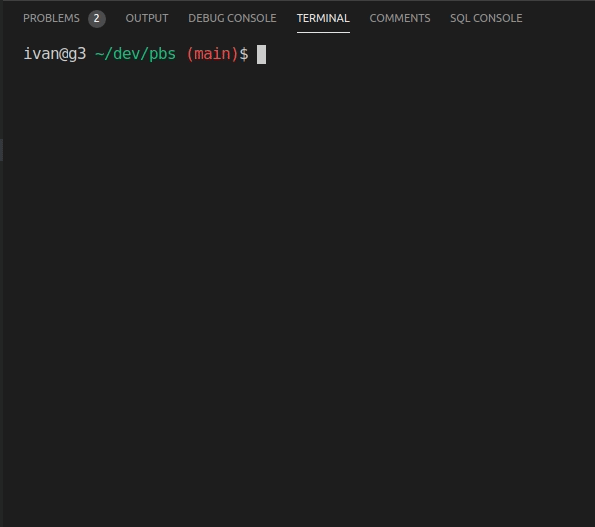
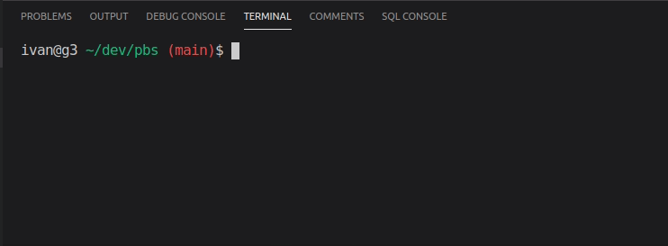
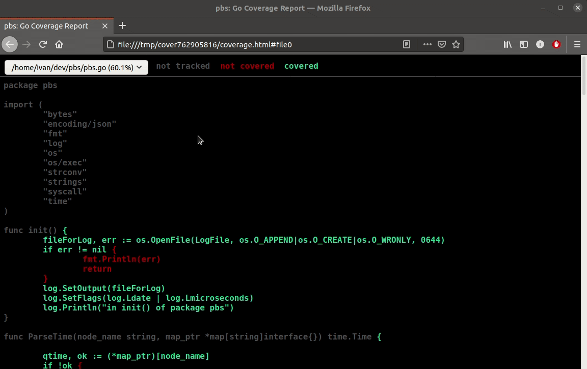

# pbs

This package allows you to run and parse the results received from pbs.
For more info about pbs you can see [here](https://www.altair.com/pbs-works-documentation/).

You need to have Python 3 installed to run the tests because it mimics the output of the `qsab`, `qstat` and `qdel` commands.

The following commands are for running a test and analyzing the code they cover.

After this command, a tab will automatically open in the browser window showing which parts of the code are covered by unit tests.

